# Setting up PostgreSQL database instance with AdventureWorks 2014
---
1. From the root directory, change directory to `AdventureWorks-for-Postgres`:
```shell
cd ./AdventureWorks-for-Postgres
```
2. Create a .env file with the sample as below:
```plain_text
POSTGRES_USER=<your_user>
POSTGRES_PASSWORD=<your_password>
```
3. Build and run the instance:
```shell
docker compose up -d
```

# Setting up environment for programming
1. Change directory to the root
2. Create a virtual environment:
```shell
python -m venv .venv
```
3. Install dependencies:
```shell
pip install -r ./requirements.txt
```

This command will install the `dbt-core` and the adapter of dbt for PostgreSQL `dbt-postgres`

# Setting up dbt project
1. Initialize dbt project with command:
```shell
dbt init
```
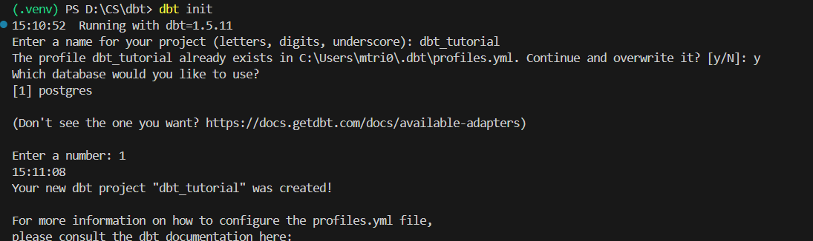

2. After this process, the `profile.yml` file in `.dbt` folder is created in the home directory, The process of creating a new dbt project creates a template that can be filled with connection properties to connect to the database. Also, it has connections for various environments: 

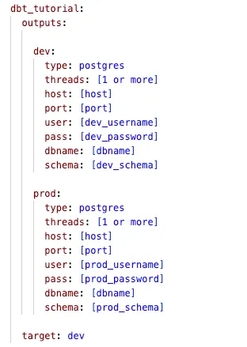

Then fill the parameters to connect to the Adventure Works db that was initiated earlier: 

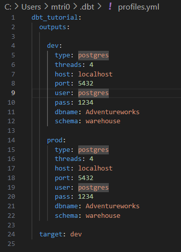

I choose the schema `warehouse` because all the artifacts created by running this project (in the **dev** environment) will be created in the `warehouse` schema in the database.

# First Model - Sales Order
The previous step also create the folder structure inside the directory with the name given to the project `dbt_tutorial`. Additionally, the `dbt_project.yml` file gets created which defines the project.

To create the model, the default path (defined inside the `dbt_project.yml` at the field `model-paths`) is `dbt_tutorial/models`. So in `models` folder, let create a folder call `warehouse` and inside it, create a file named `source_adventureworks.yml`. This will define the source, and the tables which will be referred to in this project:

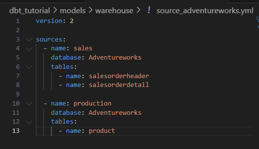

I have use the command `\dt sales.*` & `\dt production.*` to view all tables in schema `sales` & `production`

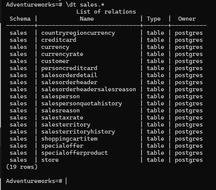 

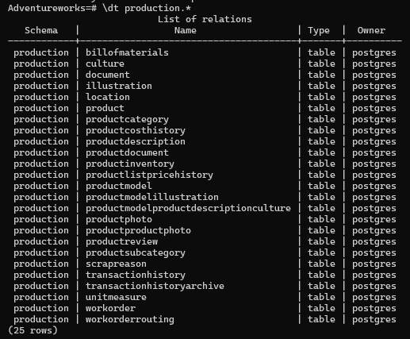

Next, let define the model `warehouse.sales_order_header`: create a new file inside `warehouse` with name `sales_order_header.sql` and define columns that will be inclued in the model:

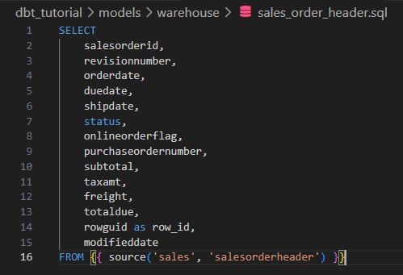

I have use command `\d+ sales.salesorderheader` to view all column of that table:

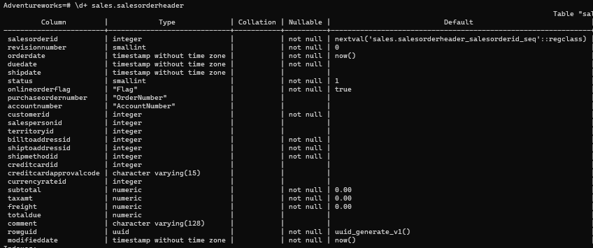

Here, some columns are being selected from the `sales.salesorderheader` table, and one column, `rowguid` is being renamed as `row_id`. The Jinja syntax `source('sales', 'salesorderheader')` refers to the source previously defined. The documentation states that it ***creates dependencies between a source and the current model, which is useful for documentation and model selection***. And takes the following arguments: 

- `<source_name>`: The `name:` defined under a `sources:` key
- `<table_name>`: The `name:` defined under a `tables:` key

When compile, this will be replaced with the source and table name. Next, lets run the model.
```shell
cd dbt_tutorial
dbt run
```

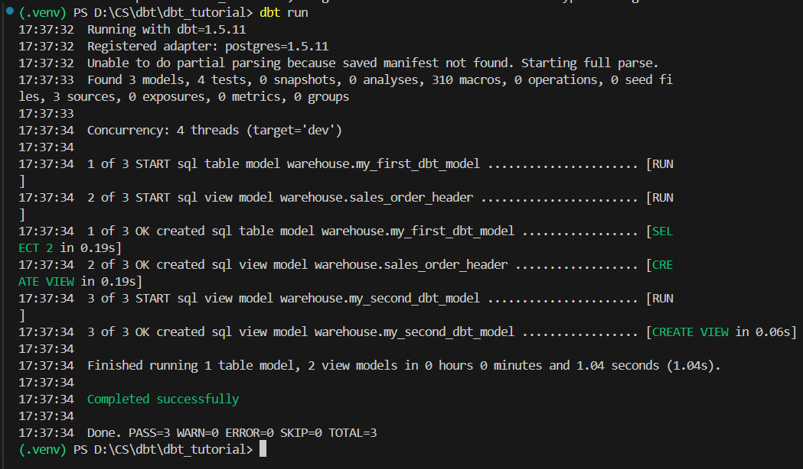

A successful run, but the logs show that a view has been create. Also, there is a new schema called `warehouse` in database, but there is no table, only a view has been created

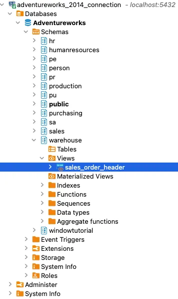

This happen because the models **are set to materialize as view** and this is defined in the `dbt__project.yml` file

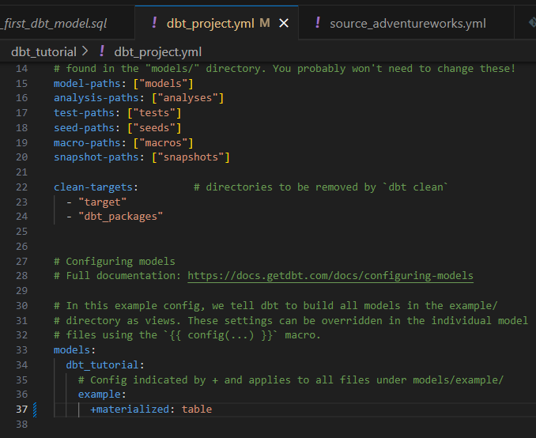 

or you can override the `dbt_project.yml` as below:

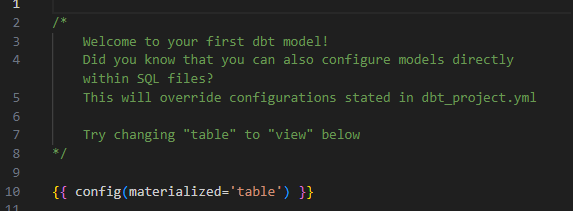

After change materialize from `view` to `table`. Let run again
```shell
dbt run --full-refresh
```

And the result as below, you can see, the view of `sale_order_header` now is no longer exist:

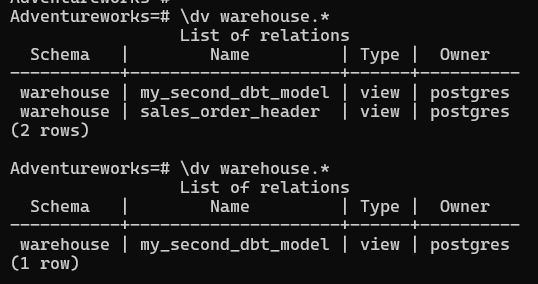

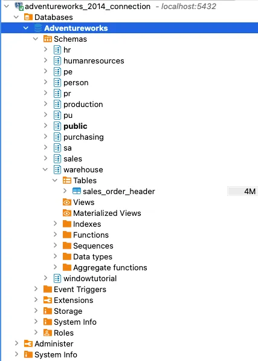

If the requirement is to materialize some models as tables, and some as views, it can be implemented by specifying the `materialized` configuration for each model in `dbt_project.yml`:

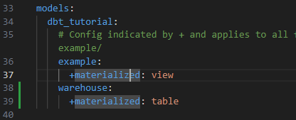

meaning that: all models in `example` folder will be materialized as views and those in `warehouse`will be materialized as table

Command `dbt run` first compile the project to generate SQL that is will execute on the target database. The generated files are present inside the target folder (`dbt_tutorial/target`), let view the SQL for creating and populating the `sales_order_header` table:

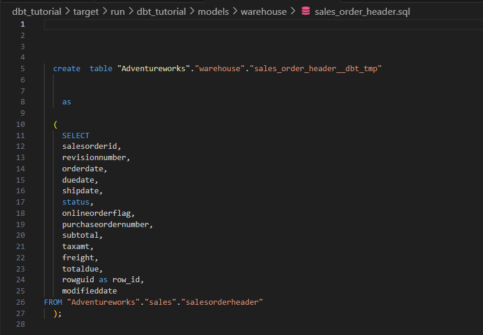 