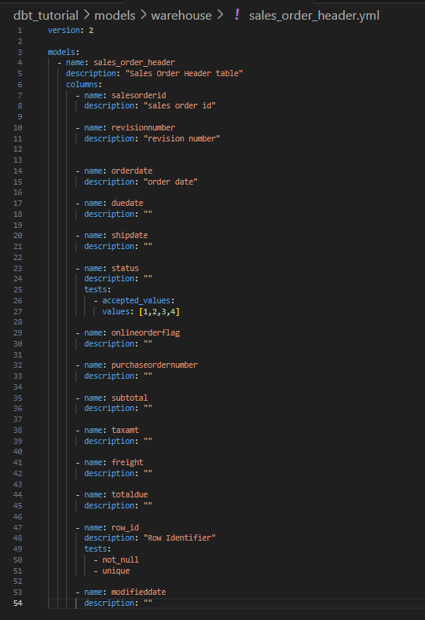

# Setting up PostgreSQL database instance with AdventureWorks 2014
1. From the root directory, change directory to `AdventureWorks-for-Postgres`:
```shell
cd ./AdventureWorks-for-Postgres
```
2. Create a .env file with the sample as below:
```plain_text
POSTGRES_USER="<your_user>"
POSTGRES_PASSWORD="<your_password>"
```
3. Build and run the instance:
```shell
docker compose up -d
```

---

# Setting up environment for programming
1. Change directory to the root
2. Create a virtual environment:
```shell
python -m venv .venv
```
3. Install dependencies:
```shell
pip install -r ./requirements.txt
```

This command will install the `dbt-core` and the adapter of dbt for PostgreSQL `dbt-postgres`

---

# Setting up dbt project
1. Initialize dbt project with command:
```shell
dbt init
```


2. After this process, the `profile.yml` file in `.dbt` folder is created in the home directory, The process of creating a new dbt project creates a template that can be filled with connection properties to connect to the database. Also, it has connections for various environments: 


Then fill the parameters to connect to the Adventure Works db that was initiated earlier: 


I choose the schema `warehouse` because all the artifacts created by running this project (in the **dev** environment) will be created in the `warehouse` schema in the database.

---

# First Model - Sales Order
The previous step also create the folder structure inside the directory with the name given to the project `dbt_tutorial`. Additionally, the `dbt_project.yml` file gets created which defines the project.

To create the model, the default path (defined inside the `dbt_project.yml` at the field `model-paths`) is `dbt_tutorial/models`. So in `models` folder, let create a folder call `warehouse` and inside it, create a file named `source_adventureworks.yml`. This will define the source, and the tables which will be referred to in this project:


I have use the command `\dt sales.*` & `\dt production.*` to view all tables in schema `sales` & `production`

 


Next, let define the model `warehouse.sales_order_header`: create a new file inside `warehouse` with name `sales_order_header.sql` and define columns that will be inclued in the model:


I have use command `\d+ sales.salesorderheader` to view all column of that table:


Here, some columns are being selected from the `sales.salesorderheader` table, and one column, `rowguid` is being renamed as `row_id`. The Jinja syntax `source('sales', 'salesorderheader')` refers to the source previously defined. The documentation states that it ***creates dependencies between a source and the current model, which is useful for documentation and model selection***. And takes the following arguments: 

- `<source_name>`: The `name:` defined under a `sources:` key
- `<table_name>`: The `name:` defined under a `tables:` key

When compile, this will be replaced with the source and table name. Next, lets run the model.
```shell
cd dbt_tutorial
dbt run
```


A successful run, but the logs show that a view has been create. Also, there is a new schema called `warehouse` in database, but there is no table, only a view has been created


This happen because the models **are set to materialize as view** and this is defined in the `dbt__project.yml` file

 

or you can override the `dbt_project.yml` as below:


After change materialize from `view` to `table`. Let run again
```shell
dbt run --full-refresh
```

And the result as below, you can see, the view of `sale_order_header` now is no longer exist:


If the requirement is to materialize some models as tables, and some as views, it can be implemented by specifying the `materialized` configuration for each model in `dbt_project.yml`:


meaning that: all models in `example` folder will be materialized as views and those in `warehouse`will be materialized as table

Command `dbt run` first compile the project to generate SQL that is will execute on the target database. The generated files are present inside the target folder (`dbt_tutorial/target`), let view the SQL for creating and populating the `sales_order_header` table:

 

---

# Defining tests
One of major capabilities that dbt provides is to **define tests and validations on columns and models**

There is a large number of built-in tests, and more can be added by using external packages, or writing custom test!. This require user to **create a model yml file for configurating model**. Inside the `models/warehouse` folder, add a new file named `sales_order_header.yml` and define each column for the `sales_order_header` model:



Here we added definitions for all the columns of the model, and have also add descriptions for some columns. *This will add documentation to the model of the column and will server as a nice reference*. This can done by **adding the** `persist_docs` configuration to `dbt_project.yml`:

***Note***: _The_ `persist_docs` _can be configured at different levels including **project-level**, **model-level** and **individual columns-level**_


After writing test configuration, let test by command: 
```shell
dbt test
```


The logs mention the generated SQL file for the test, which is present together with other tests at the path `target/compiled/dbt_tutorial/models/warehouse/sales_order_header.yml`


Now, I will open files at path `target/compiled/dbt_tutorial/models/warehouse/sales_order_header.yml/*`. These file will be directly run on the table, and all the __tests fail if they return a row__. The test has been failed here is accepted_values_sales_order_header_status__1__2__3__4. So you will need to rerun the file `accepted_values_sales_order_header_status__1__2__3__4.sql` to view and gain information about why test fails. Here, I will just select and count any record that has `status` column with value not in (1,2,3,4): 


There are more 31,000 row with value of `status` columns not in (1,2,3,4) -> the test throw fail!

---

# Advanced Testing - Adding custom tests
To create a custom test, the simplest way is to write a test in SQL that checks a condition. In dbt, this can be enhanced by referring to the model involved using __Jinja__ to refer to a source or model. This is called a singular test. It needs to be added to the `tests` folder in the `dbt_tutorial` folder.

Lets add a test to it, create a `.sql` with the name `test_due_date_before_order_date.sql`:

```SQL
SELECT duedate, orderdate, count(1) as occurrences
FROM {{ ref('sales_order_header') }}
WHERE duedate < orderdate
GROUP BY duedate, orderdate;
```


The above test, written specifically for the `orderdate` and `duedate` columns. It should be a _generic test_ that takes a column to check as parameter. This is called __generic tests__, and they should reside inside `tests/generic` folder. This generic test uses Jinja syntax to define the test as a function, and that function can later be re-used.


```SQL


SELECT {{ column_name }}, {{ greater_than_column_name }}, count(1) as num_occurrences
FROM {{ model }}
WHERE {{ column_name }} < {{ greater_than_column_name }}
GROUP BY 1,2


```

The first line defines the test with name `greater_than_column`, which is the function with parameters

This test can be used in the model `.yml` files, either at _model level_ or _column level_. When used at a column level, the values of first parameters: `model` and `column_name` are passed by dbt, and only the value of the last parameter `greater_than_column_name` needs to be passed to the test. For example, you can use this test in `sales_order_header.yml` as below:

```YAML
version:2 

models:
    - name: sales_order_header
      description: "sales order id"
    ...
    - name: orderdate
      description: ""
    - name: duedate
      description: ""
      tests:
        - greater_than_column:
            greater_than_column_name: orderdate
    ...
```

Run test:
```shell
dbt test
```
And the result: 


Below is the compiled form for the test in path `target/compiled/dbt_tutorial/tests/test_due_date_before_order_date.sql`


By default, failed tests fail the test run, but this behavior can be customized to generate a warning or fail __only if the number of failed rows exceeds a certain threshold__

---

# Building simple star schema: existing models, relationship tests, and ephemeral persistence

After getting a basic understanding of how dbt transformations are put together, lets build a fact table (the fact table in star schema) using two source tables: `sales.salesorderheader` and `sales.salesorderdetail`

## Creating sales_order_detail relation


```SQL
-- sales_order_detail.sql
SELECT 
    salesorderid
    ,salesorderdetailid
    ,carriertrackingnumber
    ,orderqty
    ,productid
    ,specialofferid
    ,unitprice
    ,unitpricediscount
    ,rowguid as row_id
    ,modifieddate
FROM {{ source('sales','salesorderdetail') }}
```

``` YAML
# sales_order_detail.yml
version: 2

models:
  - name: sales_order_detail
    description: "Intermediate sales order detail table"
    columns:
      - name: salesorderid
        description: "sales order id"
      
      - name: salesorderdetailid
        description: "sales order detail id"

      - name: orderqty
        description: ""

      - name: productid
        description: "foreign key to product table"

      - name: specialofferid
        description: ""

      - name: unitprice
        description: "Unit price"

      - name: unitpricediscount
        description: "Unit price discount"

      - name: row_id
        description: "Row identifier"
        tests:
          - not null
          - unique

      - name: modifieddate
        description: "Modified date"
```

After two above steps, let run dbt to create the tables
```shell
dbt run
```
